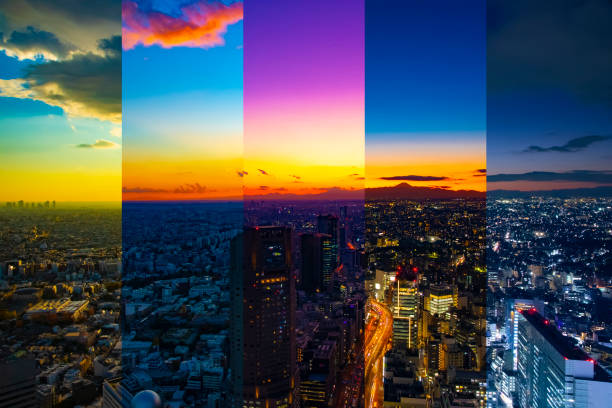
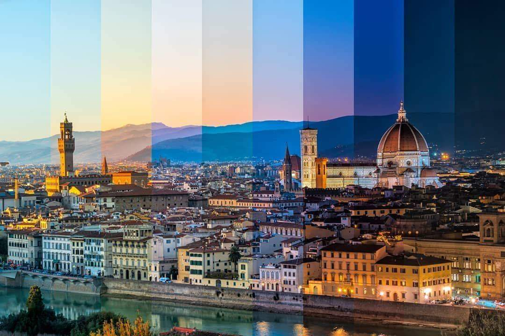

# Quiz 8 – Design Research for Final Assignment

## Part 1: Imaging Technique Inspiration

### Timelapse Day-Night Cycle Landscapes

I'm inspired by **timelapse photography that compresses an entire day-night cycle into a single continuous sequence** — the sky shifting from warm sunrise tones through bright daylight, into golden hour, deep sunset, and finally a star-filled night. What makes this technique powerful is how colour alone communicates the passage of time. The smooth gradient transitions between phases (dawn → day → dusk → night) create an immersive, meditative quality that I'd like to translate into a generative, time-based mechanic for our p5.js project. This technique naturally suits the **time-based mechanic** since the visuals are entirely driven by temporal progression rather than user input.

### Reference Images

*City skyline timelapse showing the full spectrum of sky colours from golden hour through sunset to night*

*Florence timelapse capturing the gradual colour shift from daylight through dusk to night across vertical time slices*

---

## Part 2: Coding Technique Exploration

### `lerpColor()` and `frameCount` in p5.js

The p5.js function **`lerpColor()`** smoothly interpolates between two colours based on a value from 0 to 1, making it ideal for recreating timelapse-style sky transitions. Combined with **`frameCount`** (which increments every frame) and **`sin()`** to create a looping cycle, you can define an array of sky colours (dawn orange, midday blue, sunset pink, midnight dark blue) and smoothly blend between them over time. This technique handles both the background gradient shifts and can drive changes in other scene elements — stars fading in, a sun/moon arc, or building lights switching on — all tied to the same time variable. The BarneyCodes sketch linked below demonstrates this exact approach.

### Code Example

**BarneyCodes – Day-Night Cycle in p5.js:**
[https://editor.p5js.org/BarneyCodes/sketches/GMnG2jvHG](https://editor.p5js.org/BarneyCodes/sketches/GMnG2jvHG)

This sketch uses `lerpColor()` driven by `frameCount` and trigonometric functions to cycle a generative landscape through day and night phases, smoothly blending sky colours and adjusting scene elements based on the time of day.
